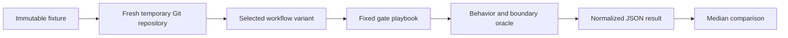

# Benchmark Layered TDD Changes Reproducibly

This benchmark materializes the same small Go project from the same Git commit for every Conductor run. It fixes the request, expected layer IDs, gate choices, verification commands, and behavioral oracle so workflow changes can be compared without confusing a shorter execution path with lower context consumption.

## Quick Path

```bash
# 1. Create a clean control project.
benchmarks/layered-tdd/scripts/materialize --variant control

# 2. Run the printed Conductor command from the generated project.

# 3. Evaluate behavior and boundaries after the run finishes.
python3 /absolute/path/to/benchmarks/layered-tdd/scripts/evaluate.py /path/to/generated/project

# 4. Convert the captured Conductor output into a comparable JSON result.
python3 /absolute/path/to/benchmarks/layered-tdd/scripts/collect-results.py \
  --variant control \
  --run-log /path/to/conductor-output.txt \
  --project /path/to/generated/project \
  --output /path/to/control.json
```

## Controlled Shape



The request adds idempotent order cancellation across exactly three independently reviewable layers:

| Layer | Boundary | Required result |
| --- | --- | --- |
| `L10-domain` | `internal/orders/order.go` | Define cancellation state transitions. |
| `L20-service` | Order service, repository, notifier | Persist once and notify once. |
| `L30-http` | `internal/httpapi` | Expose `POST /orders/{id}/cancel`. |

`internal/legacy` contains a plausible but forbidden cancellation implementation. It gives Graphify and repository search a realistic distractor without increasing the requested work.

## Materialize Variants

```bash
# Current workflow, normal test output.
benchmarks/layered-tdd/scripts/materialize --variant control

# Current workflow, deterministic high-volume test output.
benchmarks/layered-tdd/scripts/materialize --variant control-noisy --noisy

# Workflow from another directory.
benchmarks/layered-tdd/scripts/materialize \
  --variant bounded-logs \
  --workflow /path/to/candidate/workflows/conductor \
  --noisy

# Build a focused code-only Graphify graph before the run.
benchmarks/layered-tdd/scripts/materialize --variant graphify --graphify
```

The materializer never overwrites an existing directory. With no `--destination`, it creates a new directory under `${TMPDIR:-/tmp}` and prints both its path and the exact Conductor command.

## Fixed Gate Playbook

Follow [cases/idempotent-cancellation/gates.md](cases/idempotent-cancellation/gates.md) exactly. In particular:

1. Use the graph decision associated with the variant.
2. Approve the generated requirements without revision.
3. Select `L10-domain`, `L20-service`, and `L30-http` in that order.
4. Have the agent author each approved top-level test.
5. Confirm expected red evidence, approve each completed layer, and skip memory capture.

If an agent creates different layers or a gate needs an unplanned revision, retain the run but mark it non-comparable in the result notes.

## Verification Modes

| Mode | Test command | Purpose |
| --- | --- | --- |
| Normal | `make test` | Measures ordinary workflow context. |
| Noisy | `make test-noisy` | Produces deterministic verbose output to expose log-injection costs. |

Both modes execute the same tests. Noisy mode changes output volume, not behavior.

## Result Schema

`collect-results.py` extracts:

- input, output, and total tokens;
- total cost and cost by agent;
- model invocation count;
- tokens and cost per invocation;
- expected layer count;
- Git change size;
- oracle and boundary results when evaluation has run.

Compare any number of collected results:

```bash
python3 benchmarks/layered-tdd/scripts/compare-results.py \
  /path/to/control-1.json \
  /path/to/control-2.json \
  /path/to/candidate-1.json
```

Use at least three completed runs per promising variant and compare medians. A one-run smoke test is enough to reject a broken variant, but not enough to claim a token improvement.

## Fairness Checklist

- [ ] Same fixture commit and case request.
- [ ] Same model and reasoning settings.
- [ ] Same layer IDs and order.
- [ ] Same gate decisions and comments.
- [ ] Same normal/noisy verification mode.
- [ ] Same Graphify state at run start.
- [ ] Oracle passes and forbidden boundaries remain untouched.
- [ ] Revision or retry deviations are recorded.

