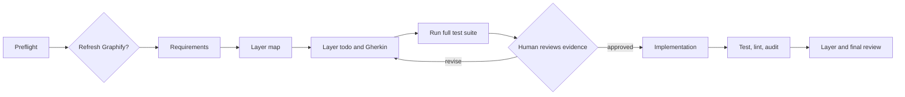
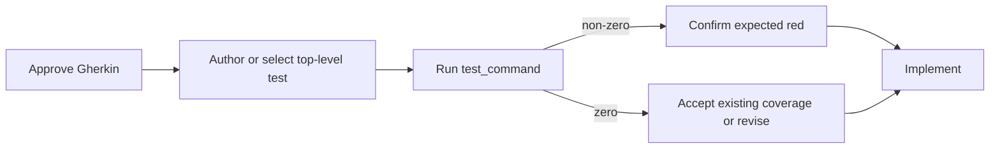

# Conductor Layered TDD

Use this workflow to take one code-changing slice from requirements to a reviewed implementation. You decide the behavior at Conductor gates; the workflow records the resulting state, comment, and evidence in local Markdown artifacts.

## Quick path

```bash
curl -sSfL https://aka.ms/conductor/install.sh | sh
gh auth login
gh skill install microsoft/conductor conductor

gentle-ai install --component conductor-layered-tdd

conductor run workflows/conductor/layered-tdd.yaml \
  --workspace-instructions \
  --web \
  --input request="Describe the code-changing task"
```

At every gate:

1. Read the linked artifact.
2. Choose the matching option in Conductor.
3. Add an optional comment if you have a caveat, approval reason, or feedback.

Do not edit frontmatter or a dashboard to make the workflow advance. The workflow persists the choice in frontmatter and `## Decision Log` for you.

## How the flow works



| You do | The workflow does |
| --- | --- |
| Approve, revise, select, stop, or add a concise comment. | Routes to the right task and records the decision. |
| Edit Markdown only to change scope, Gherkin, evidence, or another semantic contract. | Updates frontmatter as compact recovery context for later agents. |
| Review the full-suite result before production code begins. | Runs the same configured `test_command` for preflight, red-gate evidence, and final verification. |

## The red-test gate

The workflow intentionally uses the repository's full test command, not a framework-specific targeted command.



The default is `make test`. A non-zero result is captured as evidence rather than aborting the workflow. You still decide whether that failure is the expected contract failure. A zero result can be accepted only as existing coverage; otherwise revise the todo.

## Configuration

| Input | Default | Use |
| --- | --- | --- |
| `request` | required | Code-changing task for one slice. |
| `test_command` | `make test` | Full suite: preflight, red evidence, and post-implementation verification. |
| `lint_command` | `make lint` | Static checks before and after implementation. |
| `security_command` | `make audit` | Dependency/CVE checks before and after implementation. |
| `graphify_scope` | none | Focused code directory for a human-approved first Graphify build or refresh. Leave empty to refresh an existing graph from its saved root. |
| `resume_path` | none | Existing `.github/plans/<slug>` folder to continue. |
| `memory_vault`, `memory_project` | none | Optional Markdown-memory recall and capture. |

Example for a repository with different Make targets:

```bash
conductor run workflows/conductor/layered-tdd.yaml \
  --workspace-instructions \
  --web \
  --input request="Add an audit event for cancelled jobs" \
  --input test_command="make test" \
  --input lint_command="make check" \
  --input security_command="make cve"
```

## Graphify and context control

The workflow now uses explicit context: agents receive only the named inputs
they need. Markdown artifacts and Conductor gates are the durable handoff; raw
verification output is passed only to the layer reviewer.

After preflight, a human gate shows whether `graphify-out/graph.json` exists.
Choose one path:

| Choice | Result |
| --- | --- |
| Refresh/build | Runs Graphify before requirements. A first build needs `graphify_scope` focused on code, such as `src` or `packages/api`. |
| Use existing | Keeps the current graph without spending time on an update. |
| Continue without Graphify | Leaves the workflow fully functional; agents use normal focused repository inspection. |

Graph-enabled discovery, mapping, todo design, test authoring, implementation,
and review query the graph with small response budgets, then verify returned
source locations. Agents never rebuild the graph and never treat an inferred
edge as proof.

Example first build:

```bash
conductor run workflows/conductor/layered-tdd.yaml \
  --workspace-instructions \
  --web \
  --input request="Add an audit event for cancelled jobs" \
  --input graphify_scope="src"
```

## Artifacts and resume

Artifacts live under `.github/plans/` and are local working files. Their frontmatter is compact recovery context for agents; the body is the human–LLM contract and evidence. It does not currently route a new run past completed phases.

| Artifact | Read it when you need to… |
| --- | --- |
| `slice-selection.md` | choose one independently valuable slice. |
| `00-requirements.md` | confirm scope, blockers, and non-goals. |
| `01-layer-map.md` | choose the next implementation boundary. |
| `layers/*.todo.md` | review Gherkin, test evidence, scope, risks, and decisions. |
| `99-final-review.md` | approve completion and optional memory capture. |

Choose the resume path that matches what happened:

| Situation | Use | What it resumes | What it does not do |
| --- | --- | --- | --- |
| The running workflow failed and Conductor saved a checkpoint. | `conductor resume` | The failed agent, with prior workflow outputs and routing state. | It does not reread artifacts to choose a different phase. |
| You are starting a new run against an old plan folder. | `conductor run … --input resume_path=…` | The same `00-requirements.md` path; prevents a sibling folder. | It does not skip preflight or requirements analysis. |

### Resume a failed run

```bash
conductor resume workflows/conductor/layered-tdd.yaml --web
```

Use this first when the run stopped because of a provider, timeout, command, or workflow failure. It is the cheap path: Conductor restores the checkpoint and continues from the failing agent.

### Reopen an existing plan folder

Use `resume_path` when there is no usable Conductor checkpoint, for example when returning another day:

```bash
conductor run workflows/conductor/layered-tdd.yaml \
  --workspace-instructions \
  --web \
  --input request="Resume the active layered TDD slice" \
  --input resume_path=".github/plans/<slice-slug>"
```

This is a new workflow run. It still runs preflight and returns to the requirements griller, which reads and revises the existing `00-requirements.md` in place. Frontmatter provides context to agents today; it does not yet route Conductor past completed phases.

## Installation notes

`gentle-ai install --component conductor-layered-tdd` copies the workflow, prompts, and repo-local Conductor skills. It does not install Conductor itself or upgrade an existing local workflow. Re-running install or sync preserves local edits unless a file is missing.

Use Markdown memory only when you need it:

```bash
gentle-ai install \
  --component conductor-layered-tdd \
  --memory-backend markdown \
  --memory-project my-project
```

The supported memory backends are `markdown` and `none`.

## Validate before running

```bash
conductor validate workflows/conductor/layered-tdd.yaml
conductor run workflows/conductor/layered-tdd.yaml \
  --dry-run \
  --input request="Smoke test the workflow"
```

For workflow-maintainer details, see [the operator guide](../workflows/conductor/README.md) and [the original layered TDD notes](lean-workflow-v2-grill-notes.md).
