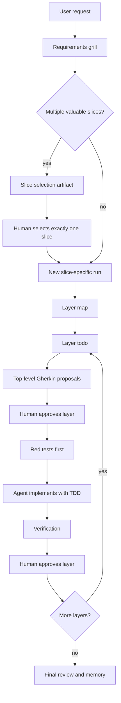

# Layered TDD Workflow Grill Notes

This note captures a separate workflow proposal discussed during validation. It is not a modification of the existing lean workflow.

The goal is to preserve a different way of thinking for future implementation: requirements grilling, slice selection, layer-level human gates, and TDD inside approved layer boundaries.

## Core Decision

Create a new workflow named `layered-tdd` that skips a standalone plan stage and uses a requirements-first grill plus layered todos.

The workflow should optimize for deterministic human-approved behavior at the top of each layer, then let the agent implement inside that boundary using TDD.



## Workflow Rules

| Area | Rule |
| ---- | ---- |
| Plan stage | Remove it as a mandatory artifact. The todo carries the operational plan. |
| Grill scope | Focus on blockers, non-blockers, and possible task split. Avoid implementation prose unless it changes requirements or risk. |
| Slice detection | Slice detection belongs to the griller. If multiple slices are found, the selected slice starts a fresh task/run with its own requirements artifact. |
| Layer mapping | Run layer mapping after requirements are confirmed. Do not fold layer mapping into a verbose plan artifact. |
| Task split | If the request contains multiple independently valuable slices, stop and ask the human to select exactly one. |
| Active work | One workflow run equals one selected slice. |
| Happy path | If the user already provides one small slice and a red test, treat that as the normal happy path: confirm requirements, map the minimal layer, run implementation, review. |
| Slice artifacts | If slicing is needed, keep the original discovery artifact and start a fresh slice-specific run for implementation. |
| Layer gate | Human approval happens per layer. |
| Layer order | The agent recommends an order, but the human selects the next layer after each gate. Do not add dependency validation in the initial version. |
| Layer todos | Create skeleton todos for all layers after layer-map approval, then detail only the layer selected by the human. |
| Architecture | Follow the repository's real boundaries. Prefer ports-and-adapters or deep-module layers when present, but do not require that architecture in every repo. |
| Test ownership | Default ownership is by layer, not per scenario. |
| Implementation mode | Derive implementation permissions from layer test ownership. Do not add a separate mode setting. |
| Gherkin | Each layer todo must include top-level Gherkin/test proposals. |
| Test waiver | A layer can waive the top-level red-test gate only with an explicit human-approved reason. |
| Red test gate | Top-level tests should be observed red before production code by default. Exceptions must be explicit. |
| Top-level tests | Human-written or human-confirmed top-level tests are read-only for the implementor by default. |
| Internal tests | The agent may add lower-level tests inside the approved layer boundary using TDD. |
| Escalation | If implementation discovers new top-level behavior, stop and revise the layer todo before continuing. |
| Checkpoints | Checkpoints are per layer, preferably appended to the active layer todo. |
| Model policy | Model selection belongs in installed agent configuration, not task artifacts. Keep the orchestrator cheap/free-model friendly. Use stronger models for ambiguity-heavy phases, and medium implementation models for small confirmed layers with tests in place. |
| Final review | Use a dedicated final-review agent. Run a tiny review after each layer and a broader final review at slice completion. The orchestrator only routes to it. |
| Memory | Final review proposes memory candidates. Memory capture happens only after human approval. |

## Suggested Artifact Shape

```text
.github/plans/<discovery-slug>/
  slice-selection.md

.github/plans/<slice-slug>/
  00-requirements.md
  01-layer-map.md
  layers/
    01-domain.todo.md
    02-application.todo.md
    03-adapter.todo.md
  99-final-review.md
```

The exact paths can change during implementation, but the separation should stay:

- discovery artifacts identify slices
- slice-specific runs hold implementation state
- each layer has its own focused todo file

After the layer map is approved, create skeleton todo files for all layers so the slice shape is visible. Only the human-selected layer should be fully detailed with Gherkin proposals, ownership, red-test gate, implementation scope, and verification.

## Requirements Grill

The grill is looking for requirements, not implementation.

It should produce a concise artifact with:

- request summary
- blocker questions
- non-blocker assumptions
- suggested task split when the request is too large
- a Mermaid or table summary when useful

If multiple slices are detected, the grill must stop before todo generation.

Slice detection is part of the griller's responsibility. Do not add a separate slicer agent initially.

When the human selects a slice, start a fresh slice-specific task/run with its own `00-requirements.md`. The discovery artifact may be referenced, but implementation state should not continue inside the discovery folder.

The fresh slice-specific run should perform a short confirmation pass, not a full re-grill of the original request. It should confirm:

- selected slice goal
- blockers for this slice only
- non-blocker assumptions for this slice only
- out-of-scope slices

```markdown
## Suggested Task Split

| Slice | User-visible value | Why split? | Can defer? |
| ----- | ------------------ | ---------- | ---------- |
| 1 | Sync new events only | Smallest useful behavior | No |
| 2 | Update changed events | Different domain rule | Yes |
| 3 | Report skipped events | Observability concern | Yes |

## Slice Selection Gate

Status: awaiting-human-selection

Rule:
Exactly one slice must be selected before requirements can be confirmed.
```

## Layer Map

After one slice is selected and requirements are confirmed, a separate layer-mapping phase proposes the high-level layer structure. The human approves or edits it before any layer todo enters implementation.

Do not make this an old-style plan artifact. The layer map should answer only:

- what layers exist for this selected slice
- why each layer matters
- recommended order
- skeleton todo filename for each layer

For ports and adapters, layers should be clear but still tied to the selected slice.

The layer map must follow the repository's real architecture. If ports-and-adapters or deep-module boundaries exist, use them. If they do not exist, propose the smallest meaningful behavioral layers visible in the codebase.

Example:

```markdown
# Layer Map: Sync New Events

## Layers

| Layer | Purpose | Human gate |
| ----- | ------- | ---------- |
| Domain | Prove event eligibility rules | Approve top-level test contracts |
| Application | Prove use case orchestration | Approve top-level test contracts |
| Adapter | Prove external persistence/API behavior | Approve top-level test contracts |
```

The layer map should recommend an order, but the orchestrator must stop after each approved layer and ask the human which layer to run next.

The initial workflow should assume the human understands the dependency implications of selecting a layer out of order. Do not add dependency checks or automatic prerequisite enforcement yet.

Keep the orchestrator dumb enough for a cheap/free model: it reads artifact state, asks for the next human selection, records the answer, and dispatches the selected subagent.

## Layer Todo Contract

Each layer gets a separate todo file focused only on that layer context.

Layer test ownership is set once for the whole layer by default:

- `human-written`: human writes the top-level red tests; agent implements production code.
- `agent-written-after-approval`: human approves the Gherkin proposals; agent writes red tests; workflow stops again for human confirmation before production code.
- `waived`: no top-level red test for this layer, with an explicit human-approved reason.

Default: `human-written`.

Waivers are allowed only at the layer level:

```markdown
## Test Ownership

Mode: waived
Reason: Existing integration coverage already proves this behavior.
Approved by: human
```

Final review must call out any waived layer.

Implementation mode is derived from test ownership:

| Test ownership | Implementation behavior |
| -------------- | ----------------------- |
| `human-written` | After the red-test gate is approved, the agent works in production-code mode and may add internal supporting tests under TDD. |
| `agent-written-after-approval` | The agent writes the approved top-level tests, stops for human confirmation, then resumes in production-code mode. |
| `waived` | The agent works in production-code mode without a top-level red test; final review flags the waiver. |

Do not add a separate implementation-mode setting.

Example:

```markdown
# Layer Todo: Domain Eligibility

## Goal

Prove and implement the core event eligibility rule for the selected slice.

## Test Ownership

Mode: human-written

## Top-Level Gherkin Proposals

### Happy Path

Scenario: Valid event is accepted
  Given an incoming event with a title, date, and external ID
  When the domain validates it for synchronization
  Then the event is accepted

### Edge Case

Scenario: Missing external ID is rejected
  Given an incoming event without an external ID
  When the domain validates it for synchronization
  Then the event is rejected with reason "missing external ID"

## Agent Implementation Scope

- Allowed: production domain code needed to satisfy the approved red tests.
- Allowed: lower-level internal tests that support the approved behavior, following TDD.
- Not allowed: adapters, UI, unrelated application wiring, or changing approved top-level behavior.

## Gate

No production code until the approved top-level tests exist and are confirmed by the human, unless this layer has an explicit waiver.
```

## TDD Boundary

The top-level layer test contracts are human-gated. Internal implementation tests are not.

Top-level tests should be observed red before production implementation by default:

```markdown
## Red Test Gate

Status: observed-red

Allowed values:
- observed-red
- not-run-human-approved
- already-passing-human-approved
- waived
```

The agent may write additional lower-level tests when all of these are true:

- the layer's top-level Gherkin proposals have been approved
- required top-level red tests have an approved red-test gate state
- the additional tests stay inside the approved layer scope
- the additional tests do not introduce or redefine top-level business behavior
- the agent follows red, green, refactor

If the agent needs a new top-level scenario, edge case, business rule, or cross-layer behavior, it must stop and route back to the layer todo.

Human-written or human-confirmed top-level tests are read-only for the implementor by default. If a top-level test is wrong, contradictory, or too broad, the implementor must stop and create a checkpoint for human review instead of changing the test to fit the implementation.

Narrow mechanical test updates are allowed only when explicitly authorized, such as fixing an import path after an approved file move.

## Layer Checkpoints

Checkpoints are per layer. Prefer appending a compact checkpoint section to the active layer todo instead of creating a separate file.

```markdown
## Checkpoint

Status: awaiting-human-decision

What happened:

Why implementation stopped:

Recommended routes:
- revise this layer todo
- approve a top-level test change
- select a different layer
- stop the slice
```

## Open Questions

- What exact frontmatter states should layer todos use?
- Should final review summarize per-layer verification only, or also include a compact decision log?
- How should memory capture distinguish durable workflow decisions from task-local artifacts?

## Agent Model Policy

Model selection should be configured in the installed agents, not recorded in workflow artifacts.

Recommended defaults:

| Agent responsibility | Model class |
| -------------------- | ----------- |
| Orchestration, artifact routing, gate detection | Cheap/free |
| Requirements grill, slice detection, layer map proposal, Gherkin proposal | Strong |
| Implementation for a small confirmed layer with top-level tests in place | Medium |
| Final review | Strong |

Escalate implementation from medium to strong when tests are missing or waived, the layer touches multiple architectural boundaries, the area is safety-sensitive, verification fails repeatedly, or the agent discovers possible top-level behavior changes.

## Final Review

Use a dedicated `final-review` agent. The implementor should not be the only reviewer of its own work, and the orchestrator should stay mechanical.

Run final review at two depths:

| Moment | Depth | Purpose |
| ------ | ----- | ------- |
| After each layer | Tiny | Verify the layer stayed in scope, summarize tests run, and surface obvious scope creep before human layer approval. |
| At slice completion | Broader | Summarize all completed layers, check end-to-end consistency, identify memory candidates, and produce the final handoff. |

Keep the final review compact:

```markdown
# Final Review

## Result

- Completed layers:
- Tests run:
- Remaining risks:

## Diff Check

- Matches approved layer contracts: yes/no
- Scope creep detected: yes/no

## Memory Candidates

- Durable decisions:
- Reusable project facts:
```

The slice final review should include a memory gate:

```markdown
## Memory Gate

Status: awaiting-human-approval

Approve memory capture:
- [ ] yes
- [ ] no
```

Final review proposes candidates; it does not write durable memory directly.
