# Conductor Layered TDD Operator Guide

This directory contains the runnable Microsoft Conductor workflow for Gentle AI's layered TDD flow. Use this guide when you are returning to a half-finished run and need to know which artifact to open, which gate to choose, and which frontmatter values are meaningful.

## Mental Model

```mermaid
flowchart LR
    Request["User request"] --> Preflight["Preflight checks"]
    Preflight --> Requirements["00-requirements.md"]
    Requirements --> Slice{"Multiple slices?"}
    Slice -- "yes" --> SliceDoc["slice-selection.md"]
    SliceDoc --> SliceRun["fresh slice run"]
    Slice -- "no" --> LayerMap["01-layer-map.md"]
    SliceRun --> LayerMap
    LayerMap --> LayerTodo["layers/<nn>-<layer>.todo.md"]
    LayerTodo --> RedGate{"Red-test gate approved?"}
    RedGate -- "no" --> LayerTodo
    RedGate -- "yes" --> Implement["Implement layer"]
    Implement --> Verify["test + lint + audit"]
    Verify --> Review["Layer review notes"]
    Review --> More{"More layers?"}
    More -- "yes" --> LayerMap
    More -- "no" --> Final["99-final-review.md"]
    Final --> Memory{"Capture memory?"}
    Memory -- "yes" --> Capture["Markdown memory capture"]
    Memory -- "no" --> Done["Done"]
    Capture --> Done
```

| Rule | Meaning |
| --- | --- |
| One run should finish one selected slice. | If the request is large, split it first, then run one slice. |
| Humans own top-level behavior. | You approve requirements, layer choice, Gherkin, red-test state, checkpoints, and final memory. |
| Agents own bounded implementation. | The implementor may work only inside the approved layer boundary. |
| Artifacts are the memory of the run. | If chat and markdown disagree, edit the artifact and choose the matching revise gate. |
| Frontmatter records state; dashboard gates route Conductor. | Editing frontmatter helps the next agent understand state, but you still choose a Conductor gate option to move. |

## Files In This Directory

| Path | Role |
| --- | --- |
| `layered-tdd.yaml` | Runnable Conductor workflow. |
| `prompts/requirements-griller.md` | Writes `slice-selection.md` or `00-requirements.md`. |
| `prompts/slice-run-starter.md` | Creates a slice-specific `00-requirements.md` after slice selection. |
| `prompts/layer-mapper.md` | Writes `01-layer-map.md` and skeleton layer todos. |
| `prompts/layer-todo-generator.md` | Details the selected layer todo, Gherkin, test ownership, and red-test gate. |
| `prompts/implementor.md` | Implements one approved layer and records checkpoints. |
| `prompts/layer-reviewer.md` | Reviews one implemented layer after verification commands run. |
| `prompts/final-reviewer.md` | Writes `99-final-review.md`. |
| `prompts/memory-capturer.md` | Captures human-approved final memory candidates. |

## Start Or Resume

### Start

```bash
conductor run workflows/conductor/layered-tdd.yaml \
  --workspace-instructions \
  --web \
  --input request="Describe the code-changing task"
```

### Start With Explicit Commands

```bash
conductor run workflows/conductor/layered-tdd.yaml \
  --workspace-instructions \
  --web \
  --input request="Describe the code-changing task" \
  --input test_command="make test" \
  --input lint_command="make lint" \
  --input security_command="make audit"
```

### Resume A Slice Folder

```bash
conductor run workflows/conductor/layered-tdd.yaml \
  --workspace-instructions \
  --web \
  --input request="Resume the active layered TDD slice" \
  --input resume_path=".github/plans/<slice-slug>"
```

`resume_path` is authoritative: the griller revises that folder's existing
`00-requirements.md` and must not create a sibling plan folder.

### Start With Markdown Memory

```bash
conductor run workflows/conductor/layered-tdd.yaml \
  --workspace-instructions \
  --web \
  --input request="Describe the code-changing task" \
  --input memory_vault="/absolute/path/to/vault" \
  --input memory_namespace="machine/agent-memory" \
  --input memory_project="<project-slug>"
```

## Workflow Inputs

| Input | Default | Required | Used by | Notes |
| --- | --- | --- | --- | --- |
| `request` | none | yes | Requirements griller | The code-changing task. |
| `task_slug` | generated by agent | no | Requirements griller | Optional folder name under `.github/plans/`. |
| `test_command` | `make test` | no | Preflight and verification | Runs before analysis and after each implementation. |
| `lint_command` | `make lint` | no | Preflight and verification | Static checks. |
| `security_command` | `make audit` | no | Preflight and verification | Dependency/CVE/audit checks. |
| `resume_path` | none | no | Requirements griller | Existing `.github/plans/<slug>` folder to resume. |
| `memory_vault` | none | no | Requirements and final capture | Absolute Markdown memory vault root. |
| `memory_namespace` | `machine/agent-memory` | no | Requirements and final capture | Namespace under the memory vault. |
| `memory_project` | none | no | Requirements and final capture | Project slug under the memory namespace. |

## Artifact Map

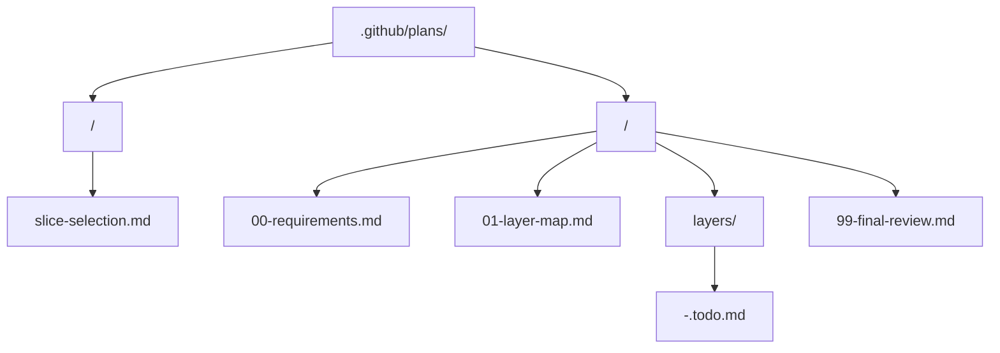

| Artifact | Created when | Human reads it to decide | Primary gate |
| --- | --- | --- | --- |
| `slice-selection.md` | Request has multiple independently valuable slices. | Which one slice to run now. | Slice selection. |
| `00-requirements.md` | One slice is ready for confirmation. | Goal, blockers, assumptions, and out-of-scope work. | Requirements. |
| `01-layer-map.md` | Requirements are approved. | Which layer to detail next. | Layer selection. |
| `layers/<nn>-<layer>.todo.md` | A layer exists in the map. | Gherkin, test ownership, red-test state, implementation boundary, tasks, review notes. | Layer todo, checkpoint, layer approval. |
| `99-final-review.md` | Final layer is approved. | Residual risks and memory candidates. | Memory. |

## Artifact Style Contract

Generated artifacts are intentionally visual-first. When you return to a run after days away, the top of each artifact should tell you where you are and what to do next without rereading paragraphs.

| Artifact | Must lead with | Main visual tools |
| --- | --- | --- |
| `slice-selection.md` | Slice decision dashboard. | Slice options table, Mermaid fresh-run flow, human decision field. |
| `00-requirements.md` | Status dashboard. | Scope map, blockers table, assumptions table, memory-used table. |
| `01-layer-map.md` | Status dashboard and layer flow. | Mermaid layer flow, layer matrix, selection board, risk table. |
| `layers/<nn>-<layer>.todo.md` | Gate dashboard. | Red-test gate table, implementation boundary table, task board, risk board. |
| Layer checkpoint section | Checkpoint dashboard. | Mismatch/scope-change table and route-options table. |
| Layer review section | Review dashboard. | Verification matrix, boundary check, issues/risks table. |
| `99-final-review.md` | Completion dashboard. | Slice flow, layer completion matrix, verification matrix, residual risks, memory candidates. |
| Memory capture section | Capture dashboard. | Capture matrix with captured/staged/promoted/skipped outcome. |

Prose should explain only what tables cannot: rationale, caveats, exact evidence, or final judgment. If an artifact becomes a long narrative, revise it into dashboards and tables before relying on it as workflow state.

## Gate Cheat Sheet

| Gate | Open this first | Choose this when ready | Choose revise when... | Choose stop when... |
| --- | --- | --- | --- | --- |
| Preflight failure | Command output in dashboard | Retry after fixing, or continue with waiver. | Not applicable. | Existing checks should be fixed outside this run. |
| Slice selection | `slice-selection.md` | Exactly one slice is selected. | The split is wrong or too large. | You only wanted discovery. |
| Requirements | `00-requirements.md` | One slice goal is clear and blockers are resolved or accepted. | You edited requirements or answered blockers in the file. | The slice is not worth doing. |
| Layer selection | `01-layer-map.md` | One next layer is selected. | Boundaries, order, or skeleton todos are wrong. | You do not want to continue this slice. |
| Layer todo | `layers/<nn>-<layer>.todo.md` | Gherkin, test ownership, and red-test gate are acceptable. | The contract, test mode, or red-test state is wrong. | The layer should not proceed. |
| Checkpoint | Active layer todo | The checkpoint is not actually new top-level behavior, or you chose a route. | Route to layer todo or layer selection if scope changed. | The contradiction blocks the slice. |
| Layer approval | Active layer todo | Approve and choose another layer, or approve and final review. | Send back for focused fixes. | You want to pause after review. |
| Memory | `99-final-review.md` | Capture approved candidates, or finish without capture. | The final review or memory candidates are wrong. | Not offered; use skip to finish. |

### Revision guarantee

Choosing **revise** at a requirements, slice-selection, layer-map, or layer-todo
gate keeps the workflow on the current artifact. The workflow routes to a
dedicated reviser with the creator's original artifact path, so it updates that
file in place and must not infer a new slug or create a sibling plan folder.

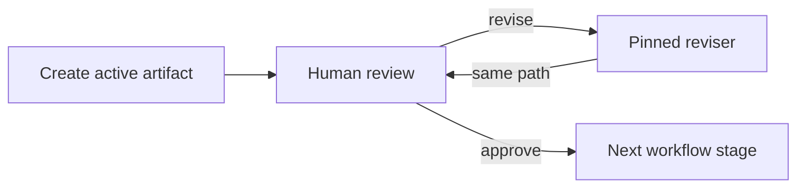

## Frontmatter Rules

Every artifact should start with YAML frontmatter. Keep it boring, explicit, and small.

```yaml
---
workflow: layered-tdd
owner: human
status: needs-human-confirmation
---
```

| Field | Applies to | Values | Meaning |
| --- | --- | --- | --- |
| `workflow` | all artifacts | `layered-tdd` | Identifies this artifact as part of this workflow. |
| `owner` | all artifacts | `human`, `agent`, specific agent name | Who currently needs to act. Most gates set `human`. |
| `status` | all artifacts | artifact-specific | Durable state for humans and agents. See the artifact tables below. Values marked "prompt-written" are produced by the workflow prompts; the others are useful human/recovery annotations. |
| `selected_slice` | `slice-selection.md` | slice slug or id | Human-selected slice to start as a fresh run. Recommended when selecting in the file. |
| `selected_layer` | `01-layer-map.md`, `layers/*.todo.md` | layer id or todo filename | Human-selected layer. Helps the todo generator choose the right file. |
| `test_ownership` | `layers/*.todo.md` | `human-written`, `agent-written-after-approval`, `waived` | Who owns top-level test creation for this layer. |
| `red_gate_state` | `layers/*.todo.md` | `observed-red`, `not-run-human-approved`, `already-passing-human-approved`, `waived`, `blocked` | Whether production implementation may start. |
| `memory_decision` | `99-final-review.md` | `capture`, `skip`, `revise` | Human memory intent. The dashboard gate still controls routing. |

### Important Routing Reality

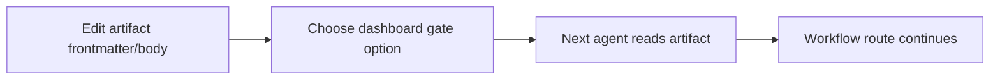

Conductor routes through the human gate option you choose in the web UI. Frontmatter does not magically jump the workflow to another node by itself. Frontmatter matters because the next agent reads it when you choose a route such as `revise`, `approve`, `selected`, or `request_fixes`.

## Artifact Frontmatter Catalog

### `slice-selection.md`

Created only when the request contains multiple valuable slices.

```yaml
---
workflow: layered-tdd
owner: human
status: slice-selection-required
selected_slice:
---
```

| Field | Values | Use this when... | Next dashboard choice |
| --- | --- | --- | --- |
| `status` | `slice-selection-required` | The agent has proposed multiple slices and needs you to choose one. | Select one slice, then choose `I selected one slice and want a fresh slice-specific run`. |
| `status` | `selected` | You wrote the chosen slice into `selected_slice` or clearly marked it in the body. | Choose selected. |
| `status` | `blocked` | None of the slices can proceed without an answer. | Choose revise after adding answers, or stop. |
| `status` | `stopped` | You intentionally ended discovery. | Choose stop. |
| `selected_slice` | slice id, title, or slug | You want the slice starter to create a dedicated `.github/plans/<slice-slug>/00-requirements.md`. | Choose selected. |

Visual state:

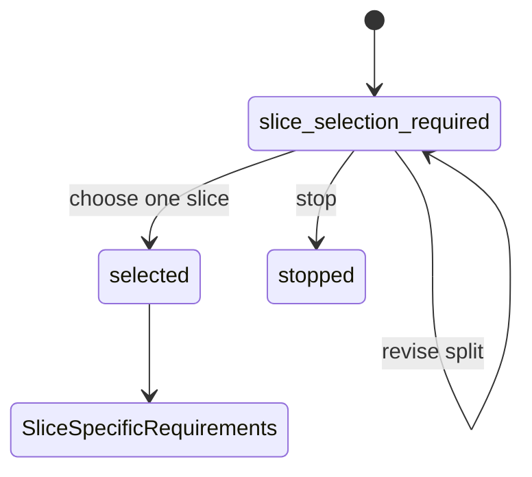

### `00-requirements.md`

The contract for one selected slice.

```yaml
---
workflow: layered-tdd
owner: human
status: needs-human-confirmation
---
```

| Field | Values | Use this when... | Next dashboard choice |
| --- | --- | --- | --- |
| `status` | `needs-human-confirmation` | Requirements are drafted and waiting for your review. | Approve, revise, or stop. |
| `status` | `blocked` | Blocker questions remain unanswered. | Answer in the file, then choose revise. |
| `status` | `confirmed` | You have confirmed goal, blockers, assumptions, and out-of-scope work. | Choose requirements approved. |
| `status` | `revising` | You edited the artifact and want the griller to reconcile it. | Choose revise. |
| `owner` | `human` | You need to answer blockers or approve. | Pick a requirements gate option. |
| `owner` | `requirements-griller` | You want the griller to reread comments and revise. | Choose revise. |

Review checklist:

| Check | Yes means... |
| --- | --- |
| Slice goal is one behavior change. | The run will not sprawl. |
| Blockers are empty or intentionally accepted. | The layer mapper can work without guessing. |
| Assumptions are non-blocking. | Wrong assumptions are risks, not hidden requirements. |
| Out-of-scope work is explicit. | The implementor has a boundary. |
| Memory notes are current or marked stale. | Old memory will not silently override repo facts. |

Visual state:

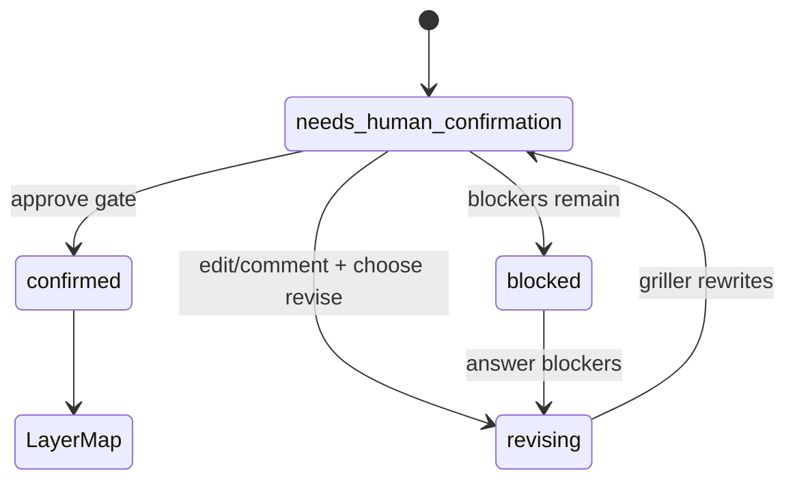

### `01-layer-map.md`

The map of real repository boundaries for the selected slice.

```yaml
---
workflow: layered-tdd
owner: human
status: needs-human-layer-selection
selected_layer:
---
```

| Field | Values | Use this when... | Next dashboard choice |
| --- | --- | --- | --- |
| `status` | `needs-human-layer-selection` | Layers exist and you need to choose the next one. | Choose selected after marking `selected_layer`. |
| `status` | `confirmed` | Layer map is acceptable and the selected layer is clear. | Choose selected. |
| `status` | `revising` | Boundaries, order, or todo list need changes. | Choose revise map. |
| `status` | `blocked` | The architecture is unclear enough that mapping should stop. | Add clarification, then revise, or stop. |
| `selected_layer` | layer id or todo filename | You want this layer detailed next. | Choose selected. |
| `owner` | `human` | Waiting for layer choice. | Select a layer. |
| `owner` | `layer-mapper` | You want the mapper to reconcile edits. | Choose revise map. |

Layer map must keep this invariant:

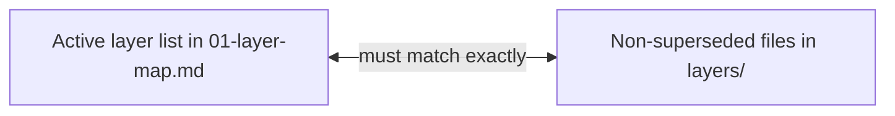

Obsolete todo handling:

| Situation | Expected state |
| --- | --- |
| Skeleton todo has no implementation or review history. | Mapper may delete it. |
| Todo has implementation or review history but no longer belongs to map. | Keep file with `status: superseded` and a note pointing to the current map. |

### `layers/<nn>-<layer>.todo.md`

The executable contract for one layer.

```yaml
---
workflow: layered-tdd
owner: human
status: needs-human-test-gate
selected_layer: <layer-id>
test_ownership: human-written
red_gate_state: blocked
---
```

#### Status Values

| `status` | Use this when... | Implementation allowed? | Next dashboard choice |
| --- | --- | --- | --- |
| `skeleton` | Mapper created a placeholder but the layer has not been detailed. | No. | Select this layer, then generate todo. |
| `needs-human-test-gate` | Gherkin/test ownership/red-test state need human approval. | No, unless gate choice approves after edits. | Approve or revise layer todo. |
| `ready-for-implementation` | Gherkin, ownership, and red-test state are approved. | Yes. | Choose layer todo approved. |
| `in-progress` | Implementor has started this layer. | Already in progress. | Wait for verification/review, or stop if needed. |
| `checkpoint` | Implementor found new top-level behavior, contradiction, or scope expansion. | No further production work until routed. | Use checkpoint gate. |
| `reviewed` | Reviewer appended notes after verification. | No new work unless fixes requested. | Approve layer, request fixes, or final review. |
| `approved` | Human approved this layer. | This layer is done. | Choose another layer or final review. |
| `superseded` | Layer is no longer in the current layer map but has history. | No. | Do not select unless you intentionally restore it in the map. |
| `blocked` | The layer cannot proceed. | No. | Revise todo, select another layer, or stop. |

#### Test Ownership Values

| `test_ownership` | Visual | Meaning | Required human action |
| --- | --- | --- | --- |
| `human-written` | Human -> test -> agent implements | You write or identify the top-level red test. | Add the test or test path/evidence, then approve red gate. |
| `agent-written-after-approval` | Human approves Gherkin -> agent writes test -> human confirms red | Agent may write top-level tests only after you approve Gherkin. | Approve Gherkin first; confirm before production code. |
| `waived` | Human waiver -> agent implements | No top-level red test for this layer. | Record a human-approved reason. |

#### Red-Test Gate Values

| `red_gate_state` | Implementation allowed? | Meaning | Evidence to record |
| --- | --- | --- | --- |
| `observed-red` | Yes | The top-level test failed before production code. | Command, test path, failure summary. |
| `not-run-human-approved` | Yes | You approved proceeding without running the red test. | Reason and scope of approval. |
| `already-passing-human-approved` | Yes | Behavior is already covered/passing and you approved using that as the gate. | Existing test path and why it is enough. |
| `waived` | Yes | You explicitly waived the top-level red-test gate. | Waiver reason. |
| `blocked` | No | Red-test state is not acceptable yet. | What must happen before implementation. |

Visual gate:

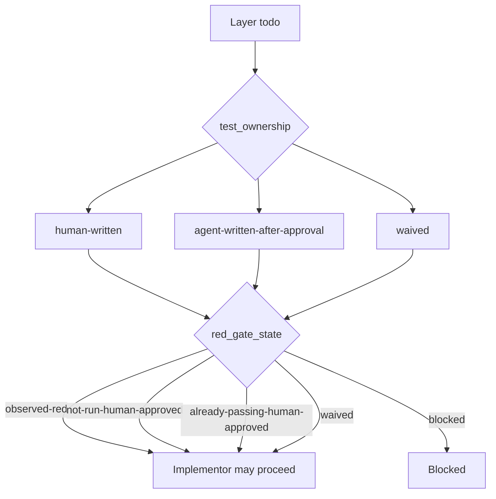

#### Suggested Layer Todo Frontmatter Shapes

Human-written test, observed red:

```yaml
---
workflow: layered-tdd
owner: human
status: ready-for-implementation
selected_layer: api-contract
test_ownership: human-written
red_gate_state: observed-red
---
```

Agent may write test after Gherkin approval, but production code is still blocked:

```yaml
---
workflow: layered-tdd
owner: human
status: needs-human-test-gate
selected_layer: persistence
test_ownership: agent-written-after-approval
red_gate_state: blocked
---
```

Waived top-level red test:

```yaml
---
workflow: layered-tdd
owner: human
status: ready-for-implementation
selected_layer: logging
test_ownership: waived
red_gate_state: waived
---
```

Checkpoint:

```yaml
---
workflow: layered-tdd
owner: human
status: checkpoint
selected_layer: domain-rules
test_ownership: human-written
red_gate_state: observed-red
---
```

### `99-final-review.md`

The end-of-slice review and memory decision artifact.

```yaml
---
workflow: layered-tdd
owner: human
status: needs-human-memory-decision
memory_decision:
---
```

| Field | Values | Use this when... | Next dashboard choice |
| --- | --- | --- | --- |
| `status` | `needs-human-memory-decision` | Final review exists and memory candidates need approval/skip/revision. | Capture, skip, or revise. |
| `status` | `complete` | The slice is done and memory decision is handled. | Workflow should terminate. |
| `status` | `revising` | Final summary, risks, or candidates need changes. | Choose revise final review. |
| `memory_decision` | `capture` | You marked specific candidates as approved. | Choose capture. |
| `memory_decision` | `skip` | You do not want memory capture. | Choose skip. |
| `memory_decision` | `revise` | You want the final reviewer to rewrite candidates or risks. | Choose revise. |

Memory capture only uses Markdown memory. It does not use Engram or MCP memory tools.

| Memory inputs available? | What happens when you choose capture |
| --- | --- |
| `memory_vault` and `memory_project` are provided, vault exists. | Approved candidates are staged or promoted under the project memory folder. |
| Project folder does not exist but vault exists. | Creates only the minimal `inbox/staged-observations.md` path. |
| Vault or project input is missing. | Capture is skipped and final review records why. |

## Stage-By-Stage Playbook

### 1. Preflight

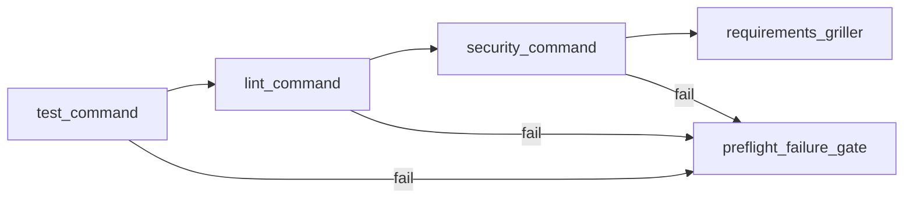

| If... | Do this |
| --- | --- |
| A command fails because the repo is genuinely broken. | Fix it, then choose retry. |
| The command name is wrong for this repo. | Restart with overridden `test_command`, `lint_command`, or `security_command`. |
| You knowingly accept the existing failure. | Choose continue with waiver. |

### 2. Requirements

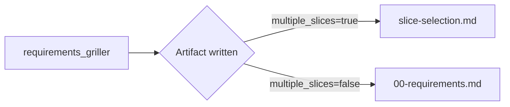

What to do:

| File | Your action |
| --- | --- |
| `slice-selection.md` | Select one slice only. Do not try to implement all slices in one run. |
| `00-requirements.md` | Confirm goal, blockers, assumptions, and out-of-scope work. |

### 3. Layer Map

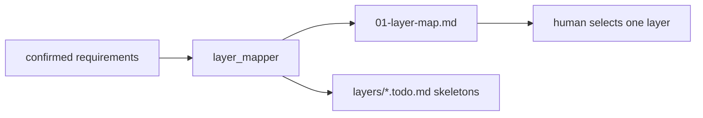

What to check:

| Check | Why |
| --- | --- |
| Layers match real repo boundaries. | Prevents one layer from becoming a full feature. |
| Recommended order is sensible. | Helps avoid hidden dependencies. |
| Each layer has a todo filename. | The next agent needs a concrete target. |
| Removed layers are deleted or superseded. | Prevents stale todos from being selected later. |

### 4. Layer Todo And Red-Test Gate

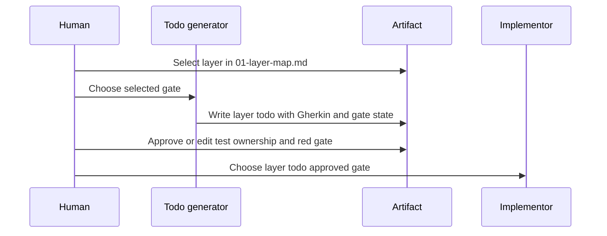

What must be clear before implementation:

| Required item | Where |
| --- | --- |
| Gherkin or equivalent top-level behavior contract. | Layer todo body. |
| Implementation boundary. | Layer todo body. |
| `test_ownership`. | Layer todo frontmatter. |
| `red_gate_state`. | Layer todo frontmatter. |
| Evidence or waiver reason. | Layer todo body. |

### 5. Implementation, Verification, Review

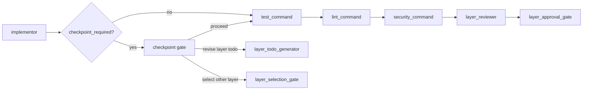

Layer approval choices:

| Choice | Route | Use when... |
| --- | --- | --- |
| Approve this layer and choose another layer. | `layer_selection_gate` | More layers remain. |
| Approve this layer and run final slice review. | `final_reviewer` | This was the last useful layer. |
| Send the layer back for focused fixes. | `implementor` | Review found bounded issues. |
| Stop this slice. | `stopped` | You want to pause or abandon. |

### 6. Final Review And Memory

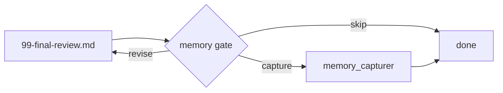

Before choosing capture:

| Check | Reason |
| --- | --- |
| Candidates are durable, not task-local noise. | Memory should help future work. |
| Sensitive values are excluded. | Capturer must not persist secrets or raw transcripts. |
| Approved candidates are clearly marked. | Capturer captures only human-approved candidates. |
| Memory inputs were provided. | Otherwise capture records that memory was unavailable. |

## Quick Recovery Matrix

| You see... | Open... | Set/check... | Choose... |
| --- | --- | --- | --- |
| "I forgot where I am." | Latest `.github/plans/<slug>/` folder | Highest-numbered artifact with `owner: human`. | Gate matching that artifact. |
| Multiple slice ideas. | `slice-selection.md` | `status: selected`, `selected_slice: <one slice>`. | Selected fresh slice run. |
| Requirements feel wrong. | `00-requirements.md` | `status: revising`, add comments/answers. | Revise requirements; the same artifact is updated in place. |
| No idea which layer is next. | `01-layer-map.md` | `selected_layer: <todo filename>`. | Selected next layer. |
| Agent wants to implement but tests are unclear. | Active layer todo | `test_ownership`, `red_gate_state`, evidence. | Revise or approve layer todo. |
| New behavior appeared during implementation. | Active layer todo | `status: checkpoint`, checkpoint notes. | Checkpoint gate route. |
| Verification failed after implementation. | Active layer todo and dashboard output | Review notes and failures. | Request focused fixes. |
| Slice seems done. | `99-final-review.md` | `status: needs-human-memory-decision`, approved candidates. | Capture or skip. |

## Minimal Artifact Templates

### Requirements

```markdown
---
workflow: layered-tdd
owner: human
status: needs-human-confirmation
---

# Requirements

## Status Dashboard

| Field | Value |
| --- | --- |
| Status | `needs-human-confirmation` |
| Owner | `human` |
| Task slug |  |
| Blocker count |  |
| Next decision | Confirm, revise, or stop. |

## Scope Map

| Area | Decision |
| --- | --- |
| Slice goal |  |
| In scope |  |
| Out of scope |  |
| Dependencies |  |
| Non-goals |  |

## Blockers

| Question | Why it blocks | Owner | Answer/status |
| --- | --- | --- | --- |

## Assumptions

| Assumption | Confidence | Risk if wrong | Validation path |
| --- | --- | --- | --- |

## Memory Used

| Source | State | Impact |
| --- | --- | --- |
```

### Layer Map

````markdown
---
workflow: layered-tdd
owner: human
status: needs-human-layer-selection
selected_layer:
---

# Layer Map

## Status Dashboard

| Field | Value |
| --- | --- |
| Status | `needs-human-layer-selection` |
| Owner | `human` |
| Layer count |  |
| Recommended next layer |  |
| Selected layer |  |
| Next decision | Select one layer, revise map, or stop. |

## Layer Flow

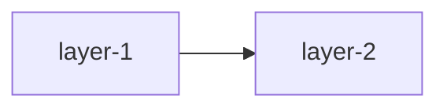

## Layer Matrix

| Order | Layer | Todo | Boundary | Dependency | Risk |
| --- | --- | --- | --- | --- | --- |

## Selection Board

| Layer | Why now | Ready? | Blocking notes |
| --- | --- | --- | --- |
````

### Layer Todo

````markdown
---
workflow: layered-tdd
owner: human
status: needs-human-test-gate
selected_layer:
test_ownership:
red_gate_state: blocked
---

# Layer Todo

## Gate Dashboard

| Field | Value |
| --- | --- |
| Selected layer |  |
| Status | `needs-human-test-gate` |
| Owner | `human` |
| Test ownership |  |
| Red-test state | `blocked` |
| Implementation allowed | no |
| Next decision | Approve, revise, select another layer, or stop. |

## Red-Test Gate

| Field | Value |
| --- | --- |
| State | `blocked` |
| Evidence command |  |
| Observed result |  |
| Waiver/approval reason |  |
| May implement? | no |

## Behavior Contract

```gherkin
Feature:
  Scenario:
    Given
    When
    Then
```

## Implementation Boundary

| Area | Allowed? | Notes |
| --- | --- | --- |
| Production files |  |  |
| Top-level tests | read-only by default |  |
| Internal tests | yes, inside boundary |  |

## Task Board

| Task | Type | Owner | Status | Notes |
| --- | --- | --- | --- | --- |

## Risk Board

| Risk | Trigger | Mitigation | Checkpoint condition |
| --- | --- | --- | --- |
````

### Final Review

````markdown
---
workflow: layered-tdd
owner: human
status: needs-human-memory-decision
memory_decision:
---

# Final Review

## Completion Dashboard

| Field | Value |
| --- | --- |
| Status | `needs-human-memory-decision` |
| Owner | `human` |
| Slice goal |  |
| Layers completed |  |
| Verification result |  |
| Residual risk count |  |
| Memory candidate count |  |
| Next decision | Capture, skip, or revise. |

## Slice Flow

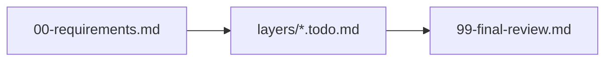

## Layer Completion Matrix

| Layer | Todo | Status | Red gate | Verification | Approval notes |
| --- | --- | --- | --- | --- | --- |

## Verification Matrix

| Command | Result | Evidence |
| --- | --- | --- |

## Memory Candidates

| Candidate | Observation | Durability | Destination | Approved? |
| --- | --- | --- | --- | --- |
````

## Validate The Workflow

```bash
conductor validate workflows/conductor/layered-tdd.yaml
conductor run workflows/conductor/layered-tdd.yaml \
  --dry-run \
  --input request="Smoke test the workflow"
```

## References

| Reference | Use it for |
| --- | --- |
| `../../docs/conductor-layered-tdd.md` | Install/sync details and broader Gentle AI component behavior. |
| `../../docs/lean-workflow-v2-grill-notes.md` | Original design notes behind the layered workflow. |
| `layered-tdd.yaml` | Exact Conductor routes and gate options. |
